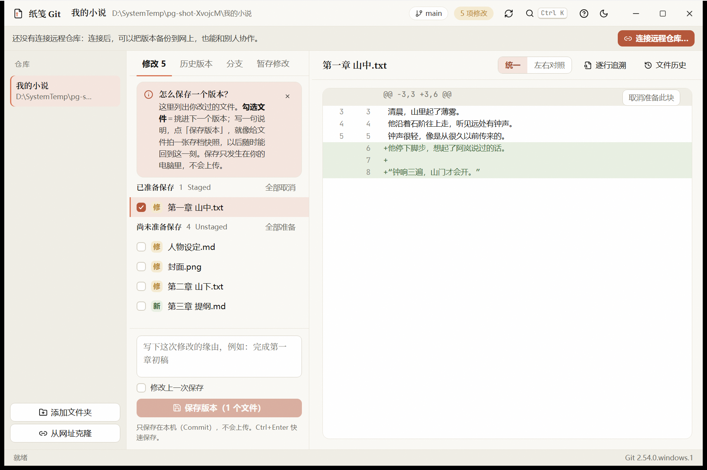
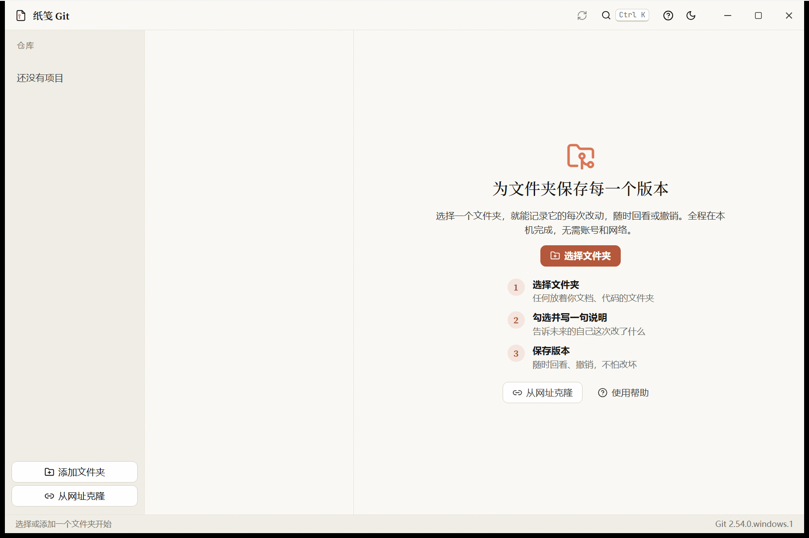
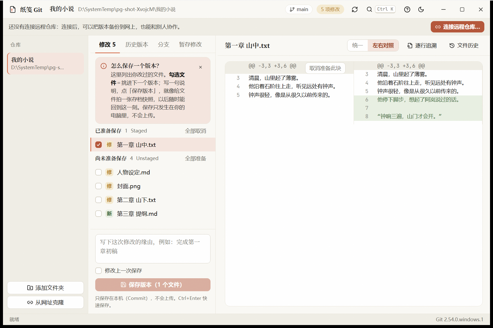
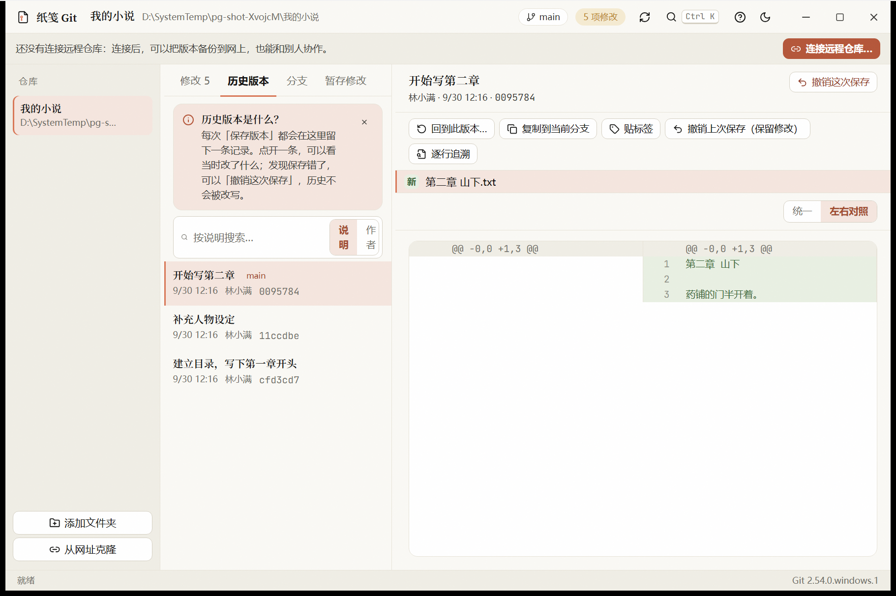
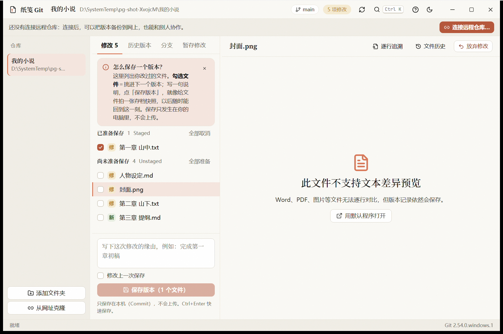
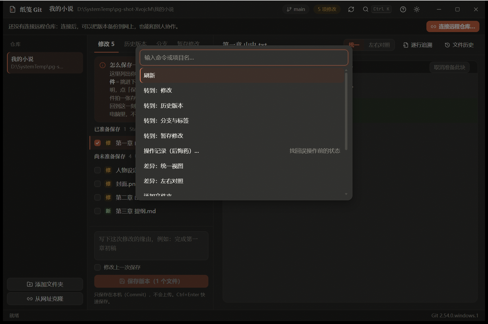
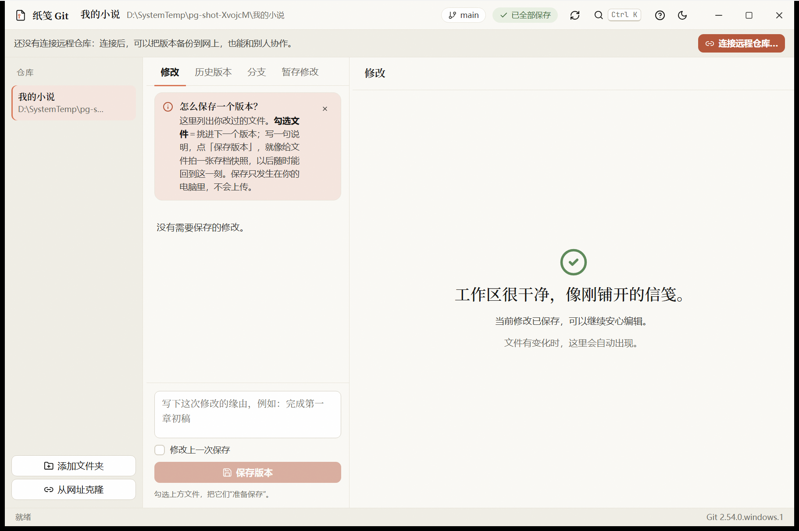

<p align="center">
  
</p>

<h1 align="center">纸笺 Git</h1>

<p align="center">
  <strong>给文件夹留下每一个版本。不用记命令，改坏了随时回到从前。</strong>
</p>

<p align="center">
  一个温暖、安静、有书卷气的 Windows Git 桌面客户端：<br>
  选择文件夹 → 勾选文件 → 写一句说明 → 保存版本。本地使用，无需账号，也无需联网。
</p>

<table align="center">
  <tr>
    <td align="center" width="25%"><strong>保存版本</strong><br>勾选文件，写一句说明，随时回看</td>
    <td align="center" width="25%"><strong>分支与合并</strong><br>放心试新点子，不满意就丢掉</td>
    <td align="center" width="25%"><strong>暂存修改</strong><br>写到一半先收进抽屉，稍后取回</td>
    <td align="center" width="25%"><strong>远程备份</strong><br>获取、拉取、上传，永不强制覆盖</td>
  </tr>
</table>

<p align="center">
  <a href="https://github.com/Neflibata003/zhijian-git/releases/tag/v0.1.0">立即下载</a>
  ·
  <a href="docs/使用说明.md">使用说明</a>
  ·
  <a href="docs/性能报告.md">性能报告</a>
  ·
  <a href="https://github.com/Neflibata003/zhijian-git/releases">查看发行版</a>
</p>

<p align="center">
  
  
  
  
  
  
</p>

<p align="center">
  
</p>

## 产品定位

纸笺 Git 面向**不熟悉 Git 的人**。它不是命令行的图形外壳，而是把日常版本管理翻译成人话：“保存版本”对应 Commit，“历史版本”对应 History，“暂存修改”对应 Stash，同时保留准确的 Git 术语作为辅助说明，避免把“保存在本机”和“上传到远程”混为一谈。

写小说、论文、报告的人可以用它保存每一稿；做设计排版的人可以给每个阶段存档（Word、PDF、图片也能存档）；写代码的人可以开分支试验、备份到 GitHub 或 Gitee。

## 运行界面

下面的图片均来自纸笺 Git 实际运行的 Release 版本，不是设计稿或占位图。

### 第一次打开

三步就能开始：选择文件夹、勾选并写一句说明、保存版本。没有仓库的文件夹会先展示目标路径并说明只会新增一个隐藏的 `.git` 文件夹；如果发现它位于另一个仓库里，会明确提示，避免误建嵌套仓库。

<p align="center">
  
</p>

### 查看修改并保存版本

文件按“已准备保存”和“尚未准备保存”分组，勾选即可挑进下一个版本。右侧显示差异，可切换统一视图与左右对照；每个代码块都能单独“准备”，同一个文件里的其他修改先不保存。

<p align="center">
  
</p>

### 历史版本

每次保存都会留下记录，支持按说明或作者搜索，并在标题旁显示分支与标签。可以撤销某次保存（新增反向版本，历史原样保留）、回到某个版本、复制到当前分支、贴标签，也能逐行追溯每一行是谁改的。

<p align="center">
  
</p>

### Word、PDF、图片等文件

二进制文件可以保存、查看状态和历史，但不会伪造文本差异，而是明确提示“此文件不支持文本差异预览”，并提供打开文件或导出历史副本的入口。

<p align="center">
  
</p>

### 深色主题与命令面板

浅色与深色共用同一套纸张与陶土色层级。按 `Ctrl+K` 打开命令面板，快速切换页面、项目和主题。

<p align="center">
  
</p>

### 当前修改已保存

只有当仓库状态确实是干净的，才会显示这句话，不会凭空给你一个错误的安心。

<p align="center">
  
</p>

## 核心能力

### 本地版本管理

- 勾选文件、写说明、保存版本；已有暂存内容不会被静默提交，界面展示的文件与实际提交的文件严格一致。
- 按文件或按代码块暂存与取消；修改上一次保存；撤销上次保存并保留修改。
- 放弃修改前展示影响范围，并说明哪些内容会永久丢失。
- 正确处理中文、空格、特殊字符路径与重命名；兼容尚无首个提交的仓库。
- 检测 Git 与提交身份；身份只设置在当前仓库，不擅自修改全局配置。

### 分支、暂存与标签

- 新建、切换、重命名、合并、删除分支；删除未合并分支前会再次提醒。
- 切换分支遇到未保存修改时，可一键收进“暂存修改”；游离 HEAD 时提示先保住最近的版本。
- 暂存修改可预览、恢复、丢弃，未跟踪的新文件也会一并收起。
- 标签管理，并在历史列表中显示。

### 远程与冲突

- 连接远程、获取更新、拉取（合并、只快进或变基）、上传，并显示领先与落后数量。
- 区分身份验证失败、网络失败、被远程拒绝和冲突，给出对应的中文提示。
- 冲突可“保留我的”“采用对方的”或手动编辑，全部解决后继续或中止操作。
- **永不强制上传**；不保存密码或令牌，网址中带凭据会被拒绝，登录交给 Git 凭据管理器。

### 其他

- 从网址克隆；操作记录（找回误操作前的状态）；回到某个版本（彻底回退需输入分支名确认）。
- 每个页面都有可关闭的“这是什么”说明卡，右上角 `？` 提供场景指南与名词解释。
- 资源管理器右键菜单加入“Git 代码仓库”，用安装包安装时写入当前用户，卸载时自动清理。

## 视觉与交互

- Claude 羊皮纸风格：暖米色纸张、深墨文字、陶土色强调，衬线标题，极淡的 SVG 纸张纹理。
- 自绘标题栏，三栏可拖动分栏并记住宽度；键盘可操作，焦点状态清晰。
- 动效克制在 160ms 左右，遵循系统“减少动态效果”设置。
- 内置 Source Serif 4 与 JetBrains Mono 子集，中文使用系统字体回退。

## 轻量设计

| 指标 | 实测（i9-14900HX，Release 版本） |
| --- | --- |
| 安装包 | 3.05 MiB |
| 冷启动到可操作 | 约 0.6 秒 |
| 空闲私有工作集（无项目） | 约 70–85 MB |
| 空闲私有工作集（小型仓库） | 约 92–95 MB |
| 空闲 CPU（稳定后） | 约 0.1% 单核 |

私有工作集统计的是应用主进程加全部 WebView2 子进程。大仓库（上万条历史加数千个文件）峰值会超过 150 MB，这是已知限制。完整数据、口径与局限见 [性能报告](docs/性能报告.md)。

实现上：使用系统 WebView2，不打包 Chromium；文件与历史列表虚拟滚动；历史每页 50 条；差异按选中文件加载并限制大小；文件监听只针对当前项目并防抖；空闲时不轮询、不调用 Git。

## 下载与运行

前往 [纸笺 Git 0.1.0 发行版](https://github.com/Neflibata003/zhijian-git/releases/tag/v0.1.0) 下载：

| 文件 | 用途 |
| --- | --- |
| `ZhijianGit-0.1.0-setup.exe` | 安装包，写入开始菜单，并添加资源管理器右键菜单“Git 代码仓库” |
| `ZhijianGit-0.1.0-portable.exe` | 便携版，双击即可运行，不含右键菜单 |
| `ZhijianGit-0.1.0.sha256.txt` | 用于核对下载文件完整性的校验值 |

**运行要求**

- Windows 10 或 11，64 位。
- 已安装 [Git for Windows](https://git-scm.com/download/win)；没有时程序会提示并给出链接。
- WebView2：Windows 11 自带；安装包内置引导程序。
- 不需要账号；只有安装 Git 和备份到远程时才需要联网。

> 安装包和程序目前没有代码签名，Windows SmartScreen 可能提示“未知发布者”，请核对校验值后再运行。

## 数据与隐私

- 保存版本只发生在本机，不会上传；只有你点“上传”才会离开电脑。
- 应用只保存最近项目列表和界面偏好，不保存密码或令牌，日志和 Git 输出有大小上限。
- 会丢失内容的操作（放弃修改、彻底回到、删除未合并分支、丢弃暂存）都先确认。
- “从列表移除项目”不会删除任何文件或版本记录。
- Tauri 权限最小化：仅事件、窗口控制、文件夹选择与保存对话框。

## 项目结构

```text
src/                            前端：App.tsx 主界面、panes.tsx 分支/暂存/同步/弹窗、help.tsx 说明与帮助、ui.tsx 虚拟列表与差异视图
src-tauri/                      Rust 后端：git.rs 全部 Git 操作与单元测试，main.rs 窗口、单实例、文件监听
src-tauri/installer-hooks.nsh   安装包钩子：写入与清理右键菜单（仅当前用户）
tests/                          端到端测试与性能测量脚本
docs/                           使用说明、性能报告、界面截图
app-icon.svg                    应用图标源文件
```

## 本地开发

前置：Rust（rustup）、Node.js 20 或更高版本、Visual Studio C++ 生成工具、Git for Windows。

```powershell
npm install
npx tauri dev          # 开发运行
npx tauri build        # 生成 exe 与 NSIS 安装包
cargo test --release --manifest-path src-tauri/Cargo.toml
```

## 测试

- **Rust 单元测试（14 项）**：路径安全、状态解析、暂存与提交分离、二进制与首个提交、代码块暂存、追溯、暂存修改、游离 HEAD、远程上传获取拉取被拒绝、冲突分类、网址与分支名校验，全部使用临时仓库。
- **端到端测试**：驱动真实 Release 程序（仅测试时开启 WebView2 调试端口），并用 `git` 命令独立核对结果，只使用系统临时目录里的测试仓库。

```powershell
node tests/e2e.mjs     # 本地版本管理主流程
node tests/e3.mjs     # 8000 个文件的大仓库：全部准备并保存
node tests/e2e2.mjs    # 分支、暂存、远程、冲突、标签、追溯、搜索、克隆
node tests/perf.mjs    # 冷启动、内存与 CPU 测量
```

## 已知限制

- 只有中文界面；没有托盘常驻和自动更新。
- 不支持交互式变基，也不支持按单行暂存（可按代码块暂存）。
- 冲突只能整个文件二选一或手动编辑，暂不支持逐块可视化选择。
- 合并版本不能被“撤销这次保存”或“复制到当前分支”。
- 提交图只在历史列表里显示分支与标签徽章，没有绘制连线。
- 大仓库下内存超过 150 MB；性能数据来自单台机器，仅供参考。
